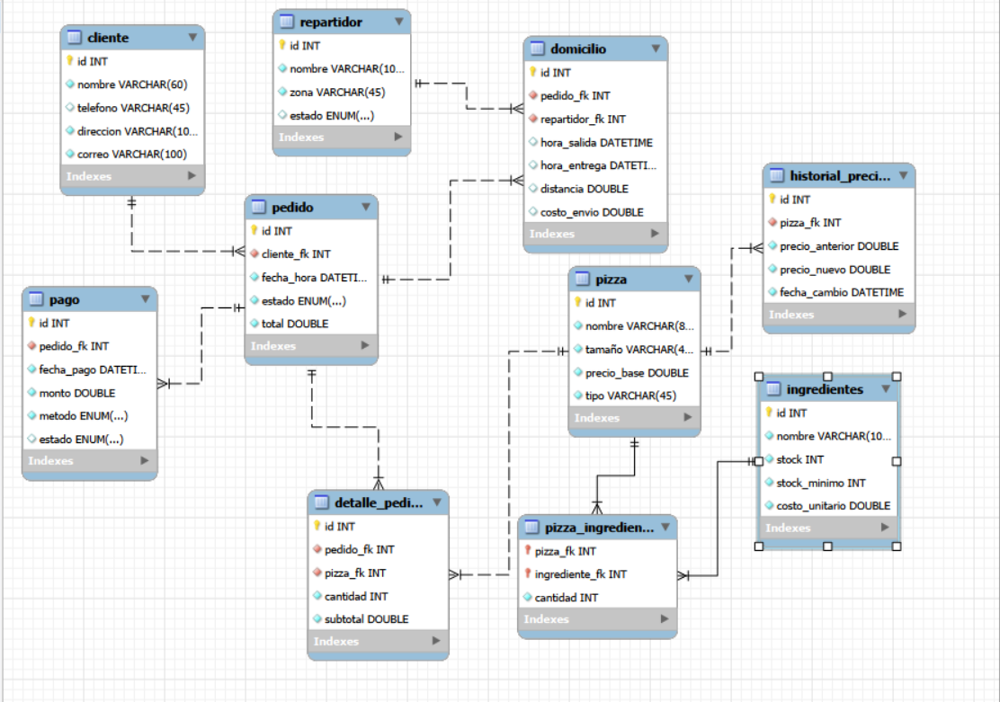

# 🍕 Base de Datos — Pizzería

## 1. Descripción del proyecto

Este proyecto consiste en el diseño e implementación de una base de datos relacional para la **Pizzería Don Piccolo**.

La base de datos permite gestionar clientes, pizzas, ingredientes, pedidos, pagos, domicilios y repartidores. Además, se implementaron funciones, un procedimiento, triggers, vistas y consultas SQL para automatizar procesos y obtener información útil del negocio.

## 2. Objetivo

El objetivo es desarrollar una base de datos que permita:

- Registrar y consultar clientes.
- Gestionar pizzas, tamaños, precios y tipos.
- Relacionar pizzas con sus ingredientes.
- Controlar el inventario de ingredientes.
- Registrar pedidos y sus detalles.
- Gestionar pagos.
- Administrar domicilios y repartidores.
- Calcular totales y ganancias.
- Automatizar procesos mediante triggers.
- Generar información mediante vistas y consultas SQL.

## 3. Modelo de la base de datos

El modelo fue diseñado e implementado utilizando **MySQL Workbench**.

El siguiente diagrama EER muestra las tablas y relaciones principales de la base de datos:



## 4. Tablas

La base de datos está compuesta por las siguientes tablas:

| Tabla | Descripción |
|---|---|
| `cliente` | Almacena la información de los clientes. |
| `pizza` | Contiene nombre, tamaño, precio base y tipo de pizza. |
| `ingredientes` | Registra los ingredientes, stock, stock mínimo y costo unitario. |
| `pizza_ingrediente` | Relaciona las pizzas con los ingredientes utilizados. |
| `pedido` | Registra los pedidos realizados por los clientes. |
| `detalle_pedido` | Contiene las pizzas, cantidades y subtotales de cada pedido. |
| `repartidor` | Registra los repartidores, zonas y estados. |
| `domicilio` | Gestiona la información de las entregas. |
| `pago` | Registra los pagos asociados a los pedidos. |
| `historial_precios` | Registra los cambios realizados en los precios de las pizzas. |

## 5. Funciones y procedimiento

### `calcular_total_pedido()`

Calcula el total de un pedido teniendo en cuenta el valor de las pizzas, el costo de envío y el IVA del 19%.

```sql
SELECT calcular_total_pedido(2);
```

### `ganancia_neta_diaria()`

Calcula la ganancia neta de un día mediante la diferencia entre las ventas y el costo de los ingredientes utilizados.

```sql
SELECT ganancia_neta_diaria('2026-09-01');
```

### `marcar_pedido_entregado()`

Procedimiento utilizado para cambiar el estado de un pedido a `entregado`.

```sql
CALL marcar_pedido_entregado(6);
```

## 6. Triggers

Se implementaron tres triggers:

### `actualizar_stock_ingredientes`

Actualiza automáticamente el stock de los ingredientes cuando se registra una pizza en un pedido.

### `registrar_cambio_precio`

Registra en `historial_precios` el precio anterior, el nuevo precio y la fecha cuando cambia el precio de una pizza.

### `liberar_repartidor`

Cuando se registra la hora de entrega de un domicilio, el repartidor asociado vuelve automáticamente al estado `disponible`.

## 7. Vistas

Se implementaron tres vistas:

### `resumen_pedidos_cliente`

Muestra el nombre del cliente, número de pedidos y total gastado.

### `rendimiento_repartidores`

Muestra el repartidor, zona, número de entregas y tiempo promedio de entrega.

### `ingredientes_stock_bajo`

Muestra los ingredientes cuyo stock es menor o igual al stock mínimo.

## 8. Consultas SQL

Se desarrollaron siete consultas para obtener información relevante:

1. Clientes con pedidos entre dos fechas utilizando `BETWEEN`.
2. Pizzas más vendidas utilizando `GROUP BY` y funciones de agregación.
3. Pedidos realizados por repartidor utilizando `JOIN`.
4. Tiempo promedio de entrega por zona utilizando `AVG`.
5. Clientes cuyo gasto supera un monto determinado utilizando `HAVING`.
6. Búsqueda de pizzas por una parte de su nombre utilizando `LIKE`.
7. Clientes frecuentes con más de cinco pedidos durante un mes mediante una subconsulta.

## 9. Tecnologías utilizadas

- **MySQL**
- **MySQL Workbench**
- **SQL**
- Modelo relacional / Diagrama EER

## 10. Archivos del proyecto

```text
database.sql
funciones.sql
triggers.sql
vistas.sql
consultas.sql
README.md
EER-pizzeria.png
```

### Descripción de los archivos

- `database.sql`: creación de la base de datos, tablas y relaciones.
- `funciones.sql`: funciones y procedimiento almacenado.
- `triggers.sql`: triggers de automatización.
- `vistas.sql`: creación de las vistas.
- `consultas.sql`: consultas solicitadas para el proyecto.
- `README.md`: documentación del proyecto.
- `EER-pizzeria.png`: evidencia gráfica del modelo de la base de datos.

## 11. Ejecución

Para ejecutar el proyecto:

1. Crear la base de datos y las tablas.
2. Insertar los datos de prueba.
3. Ejecutar las funciones y el procedimiento.
4. Ejecutar los triggers.
5. Ejecutar las vistas.
6. Ejecutar las consultas.
7. Verificar los resultados en MySQL Workbench.

## 12. Conclusión

La base de datos desarrollada permite administrar los principales procesos de la **Pizzería Don Piccolo**, centralizando la información de clientes, pizzas, ingredientes, pedidos, pagos y domicilios.

La implementación de funciones, procedimientos, triggers y vistas permite complementar el almacenamiento de datos con procesos automatizados y consultas que facilitan el análisis de la información del negocio.
